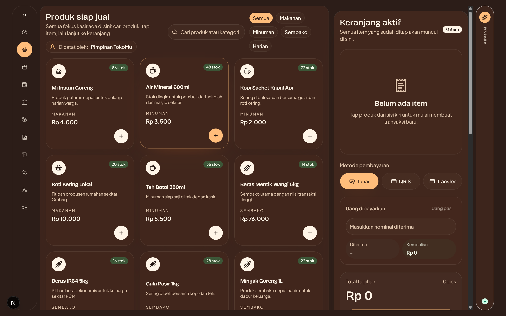

# 🛒 Kasir TokoMu (WarungOS)

TokoMu adalah **Sistem Operasi Ritel (Retail Operating System)** modern berbasis web yang dirancang dan dioptimalkan secara khusus untuk perangkat tablet. Aplikasi ini merupakan _all-in-one workspace_ yang menggabungkan berbagai alur operasional warung atau toko ritel.



---

## ✨ Fitur Utama

- 💻 **Point of Sales (Kasir)**: Antarmuka kasir layar sentuh (_touch-friendly_) dengan keranjang responsif, dukungan uang pas, kalkulasi kembalian, dan cetak struk.
- 📦 **Manajemen Inventaris**: Pengelolaan stok barang dengan notifikasi stok kritis, multi-kategori, dan pencatatan restok harian.
- 💳 **Buku Hutang (Kasbon)**: Pencatatan hutang pelanggan dengan perhitungan _progress_ cicilan, jatuh tempo, dan satu klik untuk menyalin pesan penagihan (WhatsApp).
- 🤝 **Investor & Distribusi Bagi Hasil**: Fitur transparansi keuangan untuk membagikan profit (laba bersih) sesuai _akad_ persentase investasi di akhir bulan secara otomatis.
- 📊 **Laporan Cerdas (PCM)**: Rekapitulasi laporan bulanan untuk Ketua PCM/Pemilik, mencakup laba rugi bersih, estimasi nilai aset, dan status pelaporan.
- 🤖 **Asisten AI Terintegrasi**: Chatbot AI (Gemini) yang paham konteks data toko, bisa diajak konsultasi strategi diskon, analisis laporan, dan _OCR_ faktur belanja.
- 👥 **Manajemen Karyawan**: Sistem _Role-Based Access Control_ (Pimpinan, Kasir, Admin) dengan jejak aktivitas (_Audit Log_) untuk mengawasi operasional.

---

## 🛠 Teknologi Utama

Sistem ini dibangun menggunakan sekumpulan _stack_ teknologi modern yang _Type-Safe_ dan berkinerja tinggi:

- **Framework:** Next.js (App Router), React 19
- **Database:** PostgreSQL
- **ORM & Migrations:** Drizzle ORM
- **Autentikasi:** Better Auth (Sesi berbasis cookie & database)
- **Styling:** Tailwind CSS, Shadcn UI, Framer Motion
- **AI Integrasi:** Google Generative AI (Gemini 2.0 Flash)
- **Laporan & Export:** React PDF, ExcelJS, Papaparse

---

## 🚀 Panduan Pengembangan Lokal (Local Development)

### 1. Persiapan Environment
```bash
cp .env.example .env
```
Isi konfigurasi pada file `.env` yang baru dibuat. Anda dapat menggunakan database lokal atau database cloud pilihan Anda.

### 2. Instalasi Dependensi
```bash
npm install
```

### 3. Migrasi & Seed Database
Pastikan `DATABASE_URL` sudah terhubung ke database kosong.
```bash
# Melakukan push skema ke database
npm run db:push

# Mengisi database dengan data dummy awal (produk, hutang, laporan, dll)
npm run db:seed
```

### 4. Menjalankan Server Lokal
```bash
npm run dev
```
Aplikasi dapat diakses melalui `http://localhost:3000`.

---

## 🚢 Panduan Deployment (Production)

TokoMu sangat mudah untuk di-deploy ke Vercel, Railway, VPS (via Docker), atau platform *hosting* modern lainnya.

### Standar Deployment (Vercel/Node.js)
1. Atur **Environment Variables** di _dashboard_ hosting Anda menggunakan nilai dari file `.env` production.
2. Atur **Build Command**: `npm run build`
3. Atur **Start Command**: `npm run start`

### Sinkronisasi Skema Database Production
Setelah environment terpasang, pastikan skema database *production* sudah sesuai. Anda bisa melakukan *push* skema dari lokal ke production dengan cara:
```bash
# Pastikan DATABASE_URL di lokal Anda (sementara) diubah ke URL database production
npx drizzle-kit push
```

### Mentransfer Data ke Production (Opsional)
Jika Anda ingin "menarik" (pull/transfer) data dummy atau data awal dari database lokal ke database *production*, Anda dapat menggunakan skrip bawaan:
```bash
# Ubah SOURCE_DB_URL dan TARGET_DB_URL di dalam script atau env
npx tsx scripts/transfer-data.ts
```

---

*Dibangun dengan dedikasi untuk memajukan ritel dan UMKM di seluruh nusantara.*
