# Draft Conceptual Class Diagram - TokoMu (WarungOS)

Karena aplikasi TokoMu dikembangkan menggunakan arsitektur modular fungsional (*functional architecture*) pada Next.js 16 App Router dan Drizzle ORM, diagram kelas berikut dipetakan secara **konseptual** berdasarkan pembagian layer entitas domain, modul layanan bisnis (*service modules*), repositori data (*database pool & query builder*), serta modul AI dan laporan.

```mermaid
classDiagram
    %% ================= 1. ENTITY / DOMAIN MODEL =================
    class StoreProfileEntity {
        +String userId
        +String storeName
        +String storeTagline
        +String storeAddress
        +String pcmName
        +String pcmChairmanName
        +String pcmAddress
        +String ownerName
        +String ownerWhatsapp
        +String city
        +int stockAlertThreshold
        +int profitSharePcmPct
        +int profitShareReservePct
        +PaymentMethod[] enabledPayments
        +String qrisPayload
        +String qrisImageUrl
        +String bankTransferInfo
    }

    class ProductEntity {
        +String id
        +String userId
        +String sku
        +String name
        +String category
        +int buyPrice
        +int sellPrice
        +int stock
        +int minimumStock
        +String description
        +DateTime createdAt
        +DateTime updatedAt
    }

    class TransactionEntity {
        +String id
        +String userId
        +int total
        +int paidAmount
        +int changeAmount
        +String paymentMethod
        +String recordedByUserId
        +String recordedByName
        +String shiftSessionId
        +DateTime createdAt
        +TransactionItemEntity[] items
    }

    class TransactionItemEntity {
        +String id
        +String transactionId
        +String productId
        +String productName
        +int quantity
        +int unitPrice
        +int costPrice
    }

    class DebtEntity {
        +String id
        +String userId
        +String borrowerName
        +String whatsapp
        +int amount
        +int paidAmount
        +String status
        +DateTime dueDate
        +int isPaid
        +DateTime lastReminderAt
        +DebtItemEntity[] items
        +DebtPaymentEntity[] payments
    }

    class DebtItemEntity {
        +String id
        +String debtId
        +String productId
        +String name
        +int quantity
        +int unitPrice
        +int lineTotal
    }

    class DebtPaymentEntity {
        +String id
        +String debtId
        +int amount
        +DateTime paidAt
        +String note
        +String recordedByUserId
    }

    class InvestorEntity {
        +String id
        +String workspaceOwnerId
        +String name
        +String whatsapp
        +String address
        +String notes
        +int isActive
        +InvestmentEntity[] investments
        +InvestorPayoutEntity[] payouts
    }

    class InvestmentEntity {
        +String id
        +String investorId
        +String workspaceOwnerId
        +String type
        +String akadType
        +int amount
        +numeric monthlyReturnRatePct
        +numeric profitSharePct
        +String productId
        +int unitCount
        +int unitCost
        +numeric profitSharePerUnitPct
        +DateTime startDate
        +DateTime endDate
        +int isActive
    }

    class InvestorPayoutEntity {
        +String id
        +String investmentId
        +String investorId
        +String workspaceOwnerId
        +DateTime periodStart
        +DateTime periodEnd
        +int baseProfit
        +numeric sharePct
        +int amount
        +String status
        +DateTime paidAt
        +String note
    }

    class ShiftEntity {
        +String id
        +String workspaceOwnerId
        +String name
        +String startTime
        +String endTime
        +String assignedUserId
        +int isActive
    }

    class ShiftSessionEntity {
        +String id
        +String workspaceOwnerId
        +String shiftId
        +String cashierUserId
        +DateTime startedAt
        +DateTime endedAt
        +int openingCash
        +int closingCash
        +int expectedCash
        +int difference
    }

    class MonthlyReportEntity {
        +String id
        +String workspaceOwnerId
        +int periodYear
        +int periodMonth
        +JSONB data
        +String pdfUrl
        +String status
        +DateTime finalizedAt
    }

    class AuditLogEntity {
        +String id
        +String workspaceOwnerId
        +String actorUserId
        +String eventType
        +String entityType
        +String entityId
        +String category
        +JSONB payload
        +JSONB before
        +JSONB after
        +DateTime createdAt
    }

    %% ================= 2. SERVICE / BUSINESS LOGIC MODULES =================
    class AppService {
        +getBootstrapState(userId) BootstrapData
        +createProduct(userId, draft) ProductEntity
        +updateProduct(userId, productId, draft) ProductEntity
        +deleteProduct(userId, productId) boolean
        +restockProduct(userId, productId, quantity) ProductEntity
        +createTransaction(userId, payload) TransactionResult
        +createDebt(userId, draft) DebtEntity
        +recordDebtPayment(userId, debtId, draft, actorId) DebtPaymentResult
        +markDebtPaid(userId, debtId, actorId) DebtEntity
        +remindDebt(userId, debtId) DebtEntity
        +createExpense(userId, draft) ExpenseEntity
        +updateStoreSettings(userId, settings) StoreProfileEntity
        +resetWorkspace(userId) BootstrapData
    }

    class InvestorService {
        +listInvestors(workspaceOwnerId) InvestorEntity[]
        +createInvestor(workspaceOwnerId, draft) InvestorEntity
        +updateInvestor(workspaceOwnerId, investorId, draft) InvestorEntity
        +deleteInvestor(workspaceOwnerId, investorId) boolean
        +createInvestment(workspaceOwnerId, draft) InvestmentEntity
        +closeInvestment(workspaceOwnerId, investmentId) InvestmentEntity
    }

    class ShiftService {
        +listShifts(workspaceOwnerId) ShiftEntity[]
        +createShift(workspaceOwnerId, draft) ShiftEntity
        +updateShift(workspaceOwnerId, shiftId, draft) ShiftEntity
        +openShiftSession(workspaceOwnerId, cashierUserId, draft) ShiftSessionEntity
        +closeShiftSession(workspaceOwnerId, sessionId, cashierUserId, draft) ShiftSessionEntity
    }

    class ProfitSharingService {
        +calculateProfitSharing(workspaceOwnerId, year, month) ProfitShareCalculation
        +saveProfitPayouts(workspaceOwnerId, year, month, payouts) InvestorPayoutEntity[]
        +approvePayout(workspaceOwnerId, payoutId) InvestorPayoutEntity
    }

    class ReportingService {
        +getMonthlyReportData(workspaceOwnerId, year, month) MonthlyReportAggregation
        +saveMonthlyReportDraft(workspaceOwnerId, year, month, data) MonthlyReportEntity
        +finalizeMonthlyReport(workspaceOwnerId, reportId) MonthlyReportEntity
    }

    %% ================= 3. REPOSITORY & INFRASTRUCTURE =================
    class DatabasePoolClient {
        +Pool pool
        +DrizzleClient db
        +query(sql, params) QueryResult
        +transaction(callback) Promise
    }

    class BetterAuthService {
        +BetterAuth auth
        +getSession(headers) SessionResult
        +signInEmail(credentials) AuthResult
    }

    class RBACService {
        +getUserRoleAssignment(userId) UserRoleContext
        +requireRole(allowedRoles) UserRoleContext
        +assignRole(userId, role, workspaceOwnerId) UserRoleEntity
        +listWorkspaceUsers(workspaceOwnerId) WorkspaceUser[]
        +deactivateWorkspaceUser(workspaceOwnerId, userId) boolean
    }

    class AuditLogService {
        +logEvent(context, eventInput, entity, payload) AuditLogEntity
        +listAuditLogs(workspaceOwnerId, filters) PaginatedAuditLogs
        +getAuditFacets(workspaceOwnerId) AuditFacets
    }

    %% ================= 4. AI & PDF ENGINE MODULES =================
    class GeminiVisionOCRService {
        +extractReceiptItemsFromImage(buffer, mimeType) ReceiptOCRResult
        +matchReceiptItemsWithProducts(ocrItems, products) MatchedReceiptItem[]
    }

    class AIToolsService {
        +ToolDefinition[] availableTools
        +executeToolCall(toolName, args, userId) JSONB
        +processChatSession(chatId, userId, message) AIMessageResult
    }

    class PDFGeneratorModule {
        +renderToStream(ProfitLossPDFComponent) NodeStream
        +renderToStream(PcmReportPDFComponent) NodeStream
    }

    %% ================= RELATIONSHIPS & DEPENDENCIES =================
    TransactionEntity "1" *-- "1..*" TransactionItemEntity : contains
    DebtEntity "1" *-- "0..*" DebtItemEntity : contains
    DebtEntity "1" *-- "0..*" DebtPaymentEntity : records
    InvestorEntity "1" o-- "0..*" InvestmentEntity : has
    InvestmentEntity "1" o-- "0..*" InvestorPayoutEntity : generates
    ShiftEntity "1" o-- "0..*" ShiftSessionEntity : schedules
    ShiftSessionEntity "1" o-- "0..*" TransactionEntity : encompasses

    AppService --> DatabasePoolClient : queries
    AppService --> RBACService : authorizes
    AppService --> AuditLogService : records
    AppService ..> ProductEntity : mutates
    AppService ..> TransactionEntity : creates
    AppService ..> DebtEntity : manages
    AppService ..> StoreProfileEntity : updates

    InvestorService --> DatabasePoolClient : queries
    InvestorService --> AuditLogService : records
    InvestorService ..> InvestorEntity : manages
    InvestorService ..> InvestmentEntity : manages

    ShiftService --> DatabasePoolClient : queries
    ShiftService --> AuditLogService : records
    ShiftService ..> ShiftEntity : manages
    ShiftService ..> ShiftSessionEntity : manages

    ProfitSharingService --> DatabasePoolClient : queries
    ProfitSharingService ..> InvestorPayoutEntity : creates/updates
    ProfitSharingService ..> InvestmentEntity : reads

    ReportingService --> DatabasePoolClient : queries
    ReportingService --> AuditLogService : records
    ReportingService ..> MonthlyReportEntity : manages
    ReportingService --> PDFGeneratorModule : formats stream

    AIToolsService --> AppService : invokes tool functions
    AIToolsService --> GeminiVisionOCRService : uses vision model
    GeminiVisionOCRService ..> ProductEntity : matches string
```

