# Draft Entity Relationship Diagram (ERD) - TokoMu (WarungOS)

Diagram ERD berikut direkonstruksi 100% berdasarkan skema aktual di `src/db/schema.ts` dan migrasi Better Auth (`migrations/20260608134501_tokoku-schema.sql`).

```mermaid
erDiagram
    user ||--o{ session : "memiliki sesi"
    user ||--o{ account : "memiliki kredensial/provider"
    user ||--o| store_profiles : "memiliki profil warung (1:1)"
    user ||--o| user_roles : "memiliki penugasan role (1:1)"
    user ||--o{ invitations : "membuat undangan (workspace_owner/invited_by)"
    user ||--o{ products : "membuat/mengelola produk"
    user ||--o{ investors : "memiliki investor di workspace"
    user ||--o{ investments : "mencatat akad investasi di workspace"
    user ||--o{ investor_payouts : "mengelola bagi hasil investor"
    user ||--o{ shifts : "membuat jadwal shift di workspace"
    user ||--o{ shift_sessions : "membuka/menutup sesi shift"
    user ||--o{ transactions : "melakukan/mencatat transaksi kasir"
    user ||--o{ debts : "mencatat hutang/kasbon pelanggan"
    user ||--o{ debt_payments : "mencatat pembayaran hutang"
    user ||--o{ expenses : "mencatat pengeluaran operasional"
    user ||--o{ restock_logs : "melakukan restok barang"
    user ||--o{ monthly_reports : "menyusun laporan bulanan"
    user ||--o{ ai_chats : "memiliki sesi percakapan AI"
    user ||--o{ ai_messages : "mengirim pesan AI"
    user ||--o{ audit_logs : "mencatat/menjadi aktor log"

    user {
        text id PK "UUID / String ID utama akun"
        text name "Nama lengkap pengguna"
        text email UK "Alamat email login"
        boolean emailVerified "Status verifikasi email"
        text image "URL foto profil"
        timestamptz createdAt "Timestamp pembuatan"
        timestamptz updatedAt "Timestamp perbaruan"
    }

    session {
        text id PK "ID unik sesi"
        timestamptz expiresAt "Waktu kedaluwarsa sesi"
        text token UK "Token JWT/Bearer"
        timestamptz createdAt "Waktu pembuatan"
        timestamptz updatedAt "Waktu perbaruan"
        text ipAddress "Alamat IP client"
        text userAgent "User agent browser"
        text userId FK "user.id (CASCADE)"
    }

    account {
        text id PK "ID unik akun"
        text accountId "ID akun pada provider eksternal"
        text providerId "Nama provider (credential, dll)"
        text userId FK "user.id (CASCADE)"
        text accessToken "Access token OAuth"
        text refreshToken "Refresh token OAuth"
        text idToken "ID token OAuth"
        timestamptz accessTokenExpiresAt "Kadaluwarsa access token"
        timestamptz refreshTokenExpiresAt "Kadaluwarsa refresh token"
        text scope "Otorisasi scope"
        text password "Hash password"
        timestamptz createdAt "Waktu pembuatan"
        timestamptz updatedAt "Waktu perbaruan"
    }

    verification {
        text id PK "ID unik token"
        text identifier "Email atau nomor telepon"
        text value "Token string verifikasi"
        timestamptz expiresAt "Waktu kedaluwarsa"
        timestamptz createdAt "Waktu pembuatan"
        timestamptz updatedAt "Waktu perbaruan"
    }

    store_profiles {
        text user_id PK, FK "user.id (1:1)"
        text store_name "Nama warung / toko"
        text store_tagline "Tagline atau deskripsi singkat"
        text store_address "Alamat lengkap warung"
        text pcm_name "Nama Pimpinan Cabang Muhammadiyah"
        text pcm_chairman_name "Nama Ketua PCM"
        text pcm_address "Alamat kantor PCM"
        text owner_name "Nama pemilik warung"
        text owner_whatsapp "Nomor WhatsApp pemilik"
        text city "Kota operasional"
        text business_notes "Catatan bisnis warung"
        integer stock_alert_threshold "Batas minimal peringatan stok (default 8)"
        integer profit_share_pcm_pct "Persentase bagi hasil PCM (default 30%)"
        integer profit_share_reserve_pct "Persentase dana cadangan warung (default 20%)"
        jsonb enabled_payments "Daftar metode bayar aktif (Tunai, QRIS, Transfer)"
        text qris_payload "String payload QRIS statis/dinamis"
        text qris_image_url "URL gambar QR Code QRIS"
        text bank_transfer_info "Informasi rekening transfer bank"
        timestamptz created_at "Waktu pembuatan"
        timestamptz updated_at "Waktu perbaruan"
    }

    user_roles {
        text user_id PK, FK "user.id (1:1)"
        text role "pimpinan | pengelola_keuangan | kasir"
        text workspace_owner_id FK "user.id (Pemilik workspace)"
        integer is_active "Status aktif staf (1 = aktif, 0 = nonaktif)"
        timestamptz created_at "Waktu penugasan"
        timestamptz updated_at "Waktu perbaruan"
    }

    invitations {
        text id PK "ID unik undangan"
        text workspace_owner_id FK "user.id pemilik workspace"
        text email "Email calon staf yang diundang"
        text role "pengelola_keuangan | kasir"
        text token UK "Token rahasia undangan (64 karakter)"
        text status "pending | accepted | expired"
        text invited_by_user_id FK "user.id yang mengirim undangan"
        timestamptz expires_at "Batas waktu kedaluwarsa (7 hari)"
        timestamptz created_at "Waktu pembuatan"
        timestamptz accepted_at "Waktu undangan diterima"
    }

    products ||--o{ transaction_items : "dibeli dalam transaksi"
    products ||--o{ debt_items : "dikasbon dalam hutang"
    products ||--o{ investments : "dititipkan dalam investasi konsinyasi"
    products ||--o{ restock_logs : "mencatat riwayat restok"

    products {
        text id PK "ID unik produk (prd_...)"
        text user_id FK "user.id (Pemilik workspace)"
        text sku "Kode SKU atau barcode barang"
        text name "Nama produk"
        text category "Kategori barang"
        integer buy_price "Harga beli / Harga Pokok Penjualan (HPP)"
        integer sell_price "Harga jual ke konsumen"
        integer stock "Jumlah kuantitas stok saat ini"
        integer minimum_stock "Batas minimal stok untuk notifikasi"
        text description "Deskripsi barang"
        timestamptz created_at "Waktu pembuatan"
        timestamptz updated_at "Waktu perbaruan"
    }

    investors ||--o{ investments : "memiliki kesepakatan investasi"
    investors ||--o{ investor_payouts : "menerima pembagian hasil"

    investors {
        text id PK "ID unik investor (inv_...)"
        text workspace_owner_id FK "user.id pemilik workspace"
        text name "Nama lengkap investor"
        text whatsapp "Nomor WhatsApp investor"
        text address "Alamat investor"
        text notes "Catatan kerja sama"
        integer is_active "Status aktif (1 = aktif, 0 = nonaktif)"
        timestamptz created_at "Waktu pembuatan"
        timestamptz updated_at "Waktu perbaruan"
    }

    investments ||--o{ investor_payouts : "menghasilkan payout bulanan"

    investments {
        text id PK "ID unik investasi (ivm_...)"
        text investor_id FK "investors.id"
        text workspace_owner_id FK "user.id"
        text type "uang | barang_titip_jual"
        text akad_type "murabahah_bil_wakalah | mudharabah | musyarakah | barang_titip_jual | sales_titipan | pinjaman_qardh"
        integer amount "Nominal modal uang (jika tipe uang)"
        numeric monthly_return_rate_pct "Rate return bulanan (%)"
        numeric profit_share_pct "Persentase bagi hasil umum (%)"
        text product_id FK "products.id (jika barang titip jual)"
        integer unit_count "Jumlah unit barang dititipkan"
        integer unit_cost "Harga modal per unit titipan"
        numeric profit_share_per_unit_pct "Bagi hasil per unit terjual (%)"
        timestamptz start_date "Tanggal mulai akad"
        timestamptz end_date "Tanggal selesai akad (opsional)"
        integer is_active "Status aktif investasi (1/0)"
        timestamptz created_at "Waktu pembuatan"
        timestamptz updated_at "Waktu perbaruan"
    }

    investor_payouts {
        text id PK "ID unik payout (pyo_...)"
        text investment_id FK "investments.id"
        text investor_id FK "investors.id"
        text workspace_owner_id FK "user.id"
        timestamptz period_start "Awal periode kalkulasi laba"
        timestamptz period_end "Akhir periode kalkulasi laba"
        integer base_profit "Laba dasar atau omzet item yang dihitung"
        numeric share_pct "Persentase bagi hasil yang diterapkan"
        integer amount "Nominal rupiah payout yang diterima"
        text status "draft | disetujui | dibayar"
        timestamptz paid_at "Waktu pembayaran dicatat"
        text note "Catatan pembayaran"
        timestamptz created_at "Waktu pembuatan"
        timestamptz updated_at "Waktu perbaruan"
    }

    shifts ||--o{ shift_sessions : "digunakan sebagai jadwal sesi shift"

    shifts {
        text id PK "ID unik jadwal shift (shf_...)"
        text workspace_owner_id FK "user.id pemilik workspace"
        text name "Nama shift (misal: Shift Pagi)"
        text start_time "Jam mulai shift (misal: 07:00)"
        text end_time "Jam selesai shift (misal: 15:00)"
        text assigned_user_id FK "user.id staf yang ditugaskan (opsional)"
        integer is_active "Status jadwal shift (1/0)"
        timestamptz created_at "Waktu pembuatan"
    }

    shift_sessions ||--o{ transactions : "menaungi transaksi kasir"

    shift_sessions {
        text id PK "ID unik sesi shift aktif (ses_...)"
        text workspace_owner_id FK "user.id"
        text shift_id FK "shifts.id"
        text cashier_user_id FK "user.id kasir yang membuka sesi"
        timestamptz started_at "Waktu sesi dibuka"
        timestamptz ended_at "Waktu sesi ditutup (null jika masih aktif)"
        integer opening_cash "Nominal modal kas awal laci"
        integer closing_cash "Nominal kas fisik aktual saat tutup"
        integer expected_cash "Kas ekspektasi (opening_cash + total Tunai)"
        integer difference "Selisih kas (closing_cash - expected_cash)"
    }

    transactions ||--o{ transaction_items : "memiliki rincian barang dibeli"

    transactions {
        text id PK "ID unik transaksi (trx_... / INV-...)"
        text user_id FK "user.id pemilik workspace"
        integer total "Total tagihan penjualan"
        integer paid_amount "Nominal uang dibayar konsumen"
        integer change_amount "Nominal uang kembalian"
        text payment_method "Tunai | QRIS | Transfer"
        text recorded_by_user_id FK "user.id kasir yang bertugas"
        text recorded_by_name "Nama kasir saat transaksi"
        text shift_session_id FK "shift_sessions.id (opsional)"
        timestamptz created_at "Timestamp transaksi"
    }

    transaction_items {
        text id PK "ID unik baris item (txi_...)"
        text transaction_id FK "transactions.id"
        text product_id FK "products.id"
        text product_name "Nama barang saat transaksi"
        integer quantity "Kuantitas barang dibeli"
        integer unit_price "Harga jual per unit saat transaksi"
        integer cost_price "Harga beli/HPP per unit saat transaksi"
    }

    debts ||--o{ debt_items : "memiliki rincian barang dikasbon"
    debts ||--o{ debt_payments : "memiliki riwayat cicilan bayar"

    debts {
        text id PK "ID unik kasbon/hutang (dbt_...)"
        text user_id FK "user.id pemilik workspace"
        text borrower_name "Nama pelanggan yang berhutang"
        text whatsapp "Nomor WhatsApp pelanggan"
        integer amount "Total nominal hutang awal"
        integer paid_amount "Total nominal yang sudah dibayar/dicicil"
        text status "aktif | lunas | lewat_tempo"
        timestamptz due_date "Tanggal jatuh tempo pembayaran"
        integer is_paid "Status lunas angka (1 = lunas, 0 = belum)"
        timestamptz last_reminder_at "Waktu pengingat WA terakhir dikirim"
        timestamptz created_at "Waktu pembuatan kasbon"
    }

    debt_items {
        text id PK "ID unik baris kasbon (dbi_...)"
        text debt_id FK "debts.id"
        text product_id FK "products.id (opsional)"
        text name "Nama barang atau keterangan"
        integer quantity "Kuantitas barang"
        integer unit_price "Harga per unit"
        integer line_total "Subtotal baris (quantity * unit_price)"
    }

    debt_payments {
        text id PK "ID riwayat bayar (dbp_...)"
        text debt_id FK "debts.id"
        integer amount "Nominal uang yang dibayarkan/dicicil"
        timestamptz paid_at "Waktu pembayaran"
        text note "Catatan pembayaran"
        text recorded_by_user_id FK "user.id yang mencatat"
    }

    expenses {
        text id PK "ID unik pengeluaran (exp_...)"
        text user_id FK "user.id pemilik workspace"
        text title "Judul atau keterangan pengeluaran"
        integer amount "Nominal pengeluaran rupiah"
        text category "Operasional | Belanja | Utilitas"
        timestamptz created_at "Waktu pencatatan"
    }

    restock_logs {
        text id PK "ID log restok (rst_...)"
        text workspace_owner_id FK "user.id"
        text product_id FK "products.id"
        text performed_by_user_id FK "user.id staf yang melakukan restok"
        text source "manual | ai_chat | ai_ocr"
        integer quantity "Jumlah kuantitas penambahan stok"
        integer unit_cost "Harga modal per unit saat restok (opsional)"
        text receipt_image_url "URL gambar struk (jika via OCR)"
        jsonb ocr_raw "Data mentah JSON hasil parsing vision"
        text note "Catatan penambahan stok"
        timestamptz created_at "Timestamp restok"
    }

    monthly_reports {
        text id PK "ID rekap laporan (rep_...)"
        text workspace_owner_id FK "user.id"
        integer period_year "Tahun laporan (misal: 2026)"
        integer period_month "Bulan laporan (1-12)"
        jsonb data "Snapshot rekap struktur JSON (omzet, HPP, laba)"
        text pdf_url "URL file PDF laporan (jika disimpan)"
        text status "draft | final"
        timestamptz finalized_at "Waktu laporan dikunci/difinalisasi"
        timestamptz created_at "Waktu pembuatan draft"
        timestamptz updated_at "Waktu perbaruan draft"
    }

    ai_chats ||--o{ ai_messages : "memiliki pesan percakapan"

    ai_chats {
        text id PK "ID sesi chat AI (cha_...)"
        text user_id FK "user.id pemilik sesi"
        text title "Judul percakapan AI"
        timestamptz created_at "Waktu pembuatan"
        timestamptz updated_at "Waktu perbaruan"
    }

    ai_messages {
        text id PK "ID pesan AI (msg_...)"
        text chat_id FK "ai_chats.id"
        text user_id FK "user.id pengirim"
        text role "user | assistant | tool"
        text content "Isi teks pesan"
        text tool_name "Nama function tool yang dipanggil"
        text tool_call_id "ID pemanggilan tool Gemini"
        jsonb tool_calls "Daftar pemanggilan tool dalam format JSON"
        jsonb tool_args "Argumen parameter tool JSON"
        jsonb tool_result "Hasil eksekusi tool JSON"
        timestamptz created_at "Waktu pengiriman"
    }

    audit_logs {
        text id PK "ID unik log (aud_...)"
        text workspace_owner_id FK "user.id pemilik workspace"
        text actor_user_id FK "user.id staf yang melakukan aksi"
        text event_type "Nama event (misal: TRANSACTION_CREATED)"
        text entity_type "Tipe entitas (misal: product, debt)"
        text entity_id "ID entitas yang diubah"
        text category "system | auth | transaction | inventory | financial"
        jsonb payload "Detail data pendukung event"
        jsonb before "Snapshot data sebelum diubah"
        jsonb after "Snapshot data setelah diubah"
        timestamptz created_at "Timestamp kejadian"
    }
```

