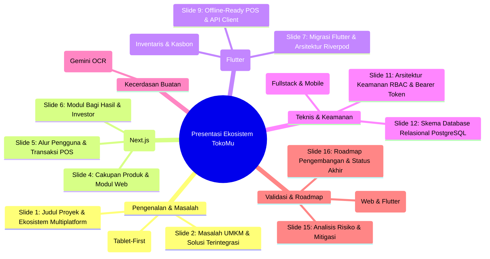

# LAPORAN MENYELURUH: EKOSISTEM TOKOMU (WARUNGOS WEB & FLUTTER MULTIPLATFORM)
*Sebagai Bahan Panduan Pembuatan Slide Presentasi (PPT), Dokumentasi Teknis, & Penjelasan Detail Setiap Bagian*

---

## DAFTAR SLIDE PRESENTASI (WEB & FLUTTER MULTIPLATFORM)



---

## BAGIAN I: SLIDE PRESENTASI & CATATAN PEMBICARA

### SLIDE 1: JUDUL & PENGENALAN EKOSISTEM PROYEK
* **Tujuan Slide:** Membuka presentasi, memperkenalkan nama aplikasi beserta ekosistem multiplatform (Web, Android Tablet, dan Windows Desktop), segmen pengguna target, dan tim pengembang.
* **Konten Slide (Visual):**
  * **Logo / Nama Aplikasi:** TokoMu (WarungOS) — *Next.js Web & Flutter Multiplatform*
  * **Tagline:** *"Tablet-First & Desktop Retail Operating System untuk UMKM dan Organisasi"*
  * **Target Pengguna:** PCM (Pimpinan Cabang Muhammadiyah) Grabag, Warung Kelontong, Toko Usaha Rumahan, dan Jaringan Mini-Market.
  * **Teknologi Utama:** Next.js 15, Flutter (Material 3), PostgreSQL, Drizzle ORM, Riverpod, Gemini AI.
* **Catatan Pembicara (Speaker Notes):**
  > Selamat pagi/siang Bapak/Ibu sekalian. Hari ini saya akan mempresentasikan **Ekosistem TokoMu (WarungOS)**, sebuah platform kasir dan manajemen ritel modern yang dirancang khusus untuk memodernisasi operasional usaha mikro, kecil, dan menengah (UMKM), serta toko ritel organisasi seperti PCM Muhammadiyah Grabag. 
  > 
  > Kami menghadirkan dua antarmuka yang terintegrasi penuh: **Web Application berbasis Next.js** untuk manajemen administratif di kantor/laptop, serta **Aplikasi Multiplatform berbasis Flutter** yang berjalan mulus di **Tablet Android** dan **PC Desktop Windows** yang biasa ditaruh di meja kasir warung. Proyek ini memadukan kemudahan transaksi kasir dengan akuntabilitas laporan keuangan formal dan integrasi kecerdasan buatan (AI).

---

### SLIDE 2: MASALAH UMKM & SOLUSI YANG DITAWARKAN
* **Tujuan Slide:** Menjelaskan latar belakang masalah yang dihadapi oleh target pengguna (UMKM) dan bagaimana aplikasi TokoMu menyelesaikannya secara komprehensif.
* **Konten Slide (Visual):**
  * **Masalah Utama:**
    * 🛑 *Kebutaan Finansial:* Uang pribadi dan uang dagangan tercampur tanpa pencatatan laba/rugi.
    * 🛑 *Metode Manual:* Masih menggunakan buku catatan kertas dan kalkulator fisik di meja kasir.
    * 🛑 *Kasbon Berantakan:* Catatan hutang pelanggan sering hilang atau lupa ditagih sampai bertahun-tahun.
    * 🛑 *Akses Modal Sulit:* Tidak punya laporan keuangan rapi untuk syarat pinjaman bank (KUR).
  * **Solusi TokoMu:**
    * ✅ Otomatisasi Pencatatan Penjualan & Pembukuan Laba/Rugi secara Real-time.
    * ✅ Modul Kasbon Digital dengan Pengingat Otomatis via WhatsApp & Cicilan Bertahap.
    * ✅ Laporan Keuangan Standar yang Dapat Diunduh (Format PDF) sesuai standar akuntansi formal.
* **Catatan Pembicara (Speaker Notes):**
  > Mengapa kita membangun TokoMu? Sebagian besar pemilik warung kelontong atau usaha kecil di Indonesia masih mengalami hambatan dalam pengelolaan keuangan. Uang hasil dagang sering dipakai untuk keperluan pribadi tanpa pencatatan, stok barang ditebak-tebak tanpa kontrol, dan pencatatan hutang pelanggan (kasbon) masih ditulis di buku kas yang rentan robek atau hilang. 
  > 
  > Akibatnya, saat mereka ingin mengajukan pinjaman modal usaha seperti KUR ke bank, mereka ditolak karena tidak memiliki catatan keuangan yang rapi. TokoMu hadir untuk menyelesaikan masalah-masalah mendasar ini secara otomatis di balik layar, mengubah setiap sentuhan jari kasir di tablet menjadi entri pembukuan keuangan yang sah.

---

### SLIDE 3: VISI & STRUKTUR PENGGUNA (WORKSPACE & RBAC)
* **Tujuan Slide:** Menjelaskan bagaimana TokoMu dapat digunakan secara kolaboratif dalam satu warung/toko menggunakan sistem Workspace dan Hak Akses (RBAC).
* **Konten Slide (Visual):**
  * **Konsep Workspace:** Satu toko dimiliki bersama oleh beberapa staf/pengelola keuangan.
  * **Peran Pengguna (Role-Based Access Control - RBAC):**
    * 👑 **Pimpinan (Workspace Owner):** Memegang kontrol penuh, melihat laporan keuangan, persentase bagi hasil, audit log, dan mengelola staf.
    * 💸 **Pengelola Keuangan:** Menambah stok, mencatat biaya pengeluaran, mengelola investasi, dan menyetujui bagi hasil.
    * 🛒 **Kasir:** Melayani transaksi penjualan dan kasbon di aplikasi mobile/desktop, tanpa akses ke data finansial strategis.
* **Catatan Pembicara (Speaker Notes):**
  > Salah satu keunggulan TokoMu adalah dukungannya terhadap kolaborasi. Aplikasi ini tidak hanya dirancang untuk satu pengguna individu, melainkan menggunakan model **Workspace Ownership**. Pengguna pertama yang mendaftar akan menjadi 'Pimpinan' atau pemilik workspace tersebut. 
  > 
  > Dari sana, Pimpinan dapat mengundang staf lain dengan hak akses terbatas (RBAC). Kasir yang bertugas di depan tablet Flutter hanya diberi akses ke layar POS (kasir cepat), Inventaris, dan Buku Hutang, sehingga mereka tidak bisa melihat keuntungan bersih warung. Sementara Pengelola Keuangan memiliki akses luas untuk mengurusi stok dan biaya operasional, namun keputusan strategis seperti pembagian hasil tetap berada di tangan Pimpinan.

---

### SLIDE 4: CAKUPAN PRODUK DAN MODUL WEB (NEXT.JS)
* **Tujuan Slide:** Memperlihatkan modul-modul fungsional administratif yang tersedia di dalam aplikasi web TokoMu.
* **Konten Slide (Visual):**
  | Modul Web | Deskripsi Fungsi Utama |
  | --- | --- |
  | **Dashboard Analitk** | Grafik pendapatan harian, laba bersih mingguan, dan ringkasan metrik toko. |
  | **Manajemen Investor** | Pencatatan modal investor (uang tunai & barang titip jual/konsinyasi). |
  | **Bagi Hasil & Payout** | Formula pembagian laba berkala untuk investor & organisasi (PCM). |
  | **Laporan PCM (PDF)** | Laporan bulanan resmi Muhammadiyah dengan fitur Cetak & Ekspor PDF. |
  | **Audit Log & Security** | Rekam jejak seluruh aktivitas staf (edit harga, hapus transaksi, login). |
* **Catatan Pembicara (Speaker Notes):**
  > Aplikasi web Next.js berfungsi sebagai pusat komando (Command Center). Melalui web ini, pimpinan dan pengelola keuangan dapat memantau performa toko dari jarak jauh. Fitur unik yang kami bawa adalah modul **Investor** dan **Bagi Hasil**, karena ritel organisasi seringkali didanai oleh beberapa investor anggota. 
  > 
  > Selain itu, karena aplikasi ini diuji coba di lingkungan PCM Muhammadiyah Grabag, kami menyediakan modul **Laporan PCM** khusus untuk menyajikan laporan bulanan berformat PDF yang siap diserahkan kepada pimpinan cabang organisasi.

---

### SLIDE 5: ALUR PENGGUNA & TRANSAKSI POS CEPAT (< 5 DETIK)
* **Tujuan Slide:** Menjelaskan detail alur transaksi harian dan kemudahan penggunaan POS baik di Web maupun Flutter Tablet.
* **Konten Slide (Visual):**
  * **Alur Penjualan Cepat (Target < 5 Detik):**
    1. 👆 *Tap* Gambar/Nama Produk di layar kasir atau scan barcode.
    2. 💳 Pilih Metode Pembayaran (Tunai, QRIS, Transfer, atau Kasbon).
    3. 💾 Klik *"Selesai"* (Transaksi tercatat, stok berkurang otomatis, cetak struk via printer thermal/browser).
  * **Validasi Stok Ganda:** Dilakukan di sisi klien (UI kasir) dan diverifikasi ulang di sisi server database untuk menghindari stok minus.
* **Catatan Pembicara (Speaker Notes):**
  > Kecepatan adalah hal krusial bagi seorang kasir warung. Jika aplikasi lambat, kasir akan kembali menggunakan kalkulator fisik. Oleh karena itu, TokoMu menerapkan alur **Tap-to-Sell** dengan desain tombol besar berstandar *Material 3*. Kasir hanya perlu menekan gambar produk di layar tablet, memilih cara pembayaran, dan menekan tombol selesai. 
  > 
  > Seluruh proses ini memakan waktu kurang dari 5 detik. Di balik layar, sistem secara real-time menjalankan transaksi database yang aman: memvalidasi kecukupan stok, mengurangi jumlah inventaris, mencatat keuntungan penjualan, serta menyiapkan struk belanja yang bisa langsung dicetak.

---

### SLIDE 6: FORMULA BAGI HASIL & PENGELOLAAN INVESTOR
* **Tujuan Slide:** Menjelaskan fitur khusus pengelolaan modal investasi dan kalkulasi keuntungan bagi hasil yang akurat.
* **Konten Slide (Visual):**
  * **Dua Tipe Investasi:**
    1. 💰 *Investasi Uang Tunai:* Pembagian hasil menggunakan persentase bagi hasil (misal: bagi rata/nisbah sesuai porsi modal).
    2. 📦 *Investasi Barang Titip Jual (Konsinyasi):* Bagi hasil dihitung otomatis berdasarkan selisih/margin dari produk yang laku terjual.
  * **Alokasi Pembagian Keuntungan:**
    * Porsi Investor (Sesuai persentase modal).
    * Alokasi PCM (Organisasi).
    * Dana Cadangan Toko.
    * Biaya Operasional Warung.
* **Catatan Pembicara (Speaker Notes):**
  > Berbeda dengan aplikasi kasir pada umumnya yang hanya mencatat jual-beli biasa, TokoMu memiliki modul **Bagi Hasil** yang canggih. Warung organisasi sering didirikan dengan modal patungan anggota atau barang titipan dari pihak ketiga (konsinyasi). 
  > 
  > Sistem kami secara otomatis membedakan kedua jenis investasi ini. Tiap akhir periode, pengelola cukup mengeklik satu tombol untuk menghitung laba bersih, mengalokasikan porsi keuntungan untuk organisasi PCM Grabag, mengisi dana cadangan toko, dan membagikan sisa keuntungan kepada para investor secara adil berdasarkan proporsi modal mereka masing-masing.

---

### SLIDE 7: MIGRASI FLUTTER & ARSITEKTUR RIVERPOD (`APPSTATEPROVIDER`)
* **Tujuan Slide:** Memaparkan terobosan teknis migrasi aplikasi kasir ke Flutter dengan arsitektur manajemen state reaktif terpusat.
* **Konten Slide (Visual):**
  * **Mengapa Flutter?** Memberikan performa *native* 60 FPS di Android Tablet dan Windows Desktop tanpa ketergantungan browser, mendukung layar sentuh kasir secara optimal.
  * **Arsitektur Riverpod (`AppStateProvider`):**
    ```mermaid
    flowchart LR
      API[Backend Next.js REST API] <--> Client[ApiClient + SharedPreferences]
      Client <--> Notifier[AppStateNotifier Riverpod]
      Notifier --> POS[KasirScreen POS]
      Notifier --> INV[InventarisScreen]
      Notifier --> DEBT[BukuHutangScreen]
      Notifier --> DASH[DashboardScreen]
    ```
  * **Satu State, Sinkron Semua Layar:** Ketika kasir melakukan transaksi atau menambah barang di *InventarisScreen*, `AppStateNotifier` memperbarui state lokal seketika dan memicu *bootstrap sync*, sehingga layar *Kasir* dan *Dashboard* langsung memperlihatkan stok dan total kasbon terbaru tanpa perlu memuat ulang (*pull-to-refresh* opsional).
* **Catatan Pembicara (Speaker Notes):**
  > Untuk memastikan pengalaman kasir yang maksimal di meja toko, kami mengembangkan **TokoMu Flutter**. Aplikasi ini dibangun menggunakan arsitektur **Riverpod (`AppStateProvider`)**. 
  > 
  > Kelebihannya adalah arsitektur reaktif terpusat: semua layar dalam aplikasi berbagi satu sumber data utama. Saat kasir mencatat pembayaran cicilan kasbon pelanggan di layar Buku Hutang, kartu statistik di layar Dashboard langsung berubah angka piutangnya dalam hitungan milidetik. Ini memberikan sensasi aplikasi profesional berskala besar yang sangat responsif.

---

### SLIDE 8: PARITAS FITUR 100% (INVENTARIS & KASBON FLUTTER)
* **Tujuan Slide:** Menunjukkan kesamaan fungsional (*parity*) dan konsistensi visual 100% antara versi Web Next.js dan aplikasi Flutter.
* **Konten Slide (Visual):**
  * **Modul Inventaris Flutter (`InventarisScreen`):**
    * 3 Kartu Statistik Konsisten: **Total SKU**, **Stok Menipis (Warn Tone)**, dan **Nilai Stok (Accent Tone)**.
    * **3-Second Undo Countdown:** Konfirmasi penghapusan barang yang memberikan timer 3 detik bagi pengguna untuk membatalkan sebelum *request delete* dikirim ke API server.
    * **Modal Dialog Lengkap:** `ProductFormDialog` (Tambah/Edit barang lengkap dengan batas minimum) dan `RestockDialog` (penambahan stok cepat).
  * **Modul Buku Hutang Flutter (`BukuHutangScreen`):**
    * **Filter Tabs:** `Semua`, `Aktif`, `Lewat Tempo`, `Lunas`.
    * **Kartu Kasbon Modern:** Progress bar cicilan, badge status berwarna, dan aksi cepat (`Ingatkan WA`, `Bayar cicilan`, `Lunas`).
    * **Dialog Pencatatan Dinamis (`DebtFormDialog`):** Mendukung pencatatan hutang dengan **rincian banyak barang sekaligus (`items`)** yang otomatis dicocokkan dengan harga produk inventaris.
    * **Dialog Rincian (`DebtDetailDialog`):** Melihat riwayat pembayaran cicilan dan mencatat pembayaran baru langsung dari modal.
* **Catatan Pembicara (Speaker Notes):**
  > Kami menjamin bahwa aplikasi Flutter memiliki **Paritas Fitur 100%** dengan versi Web. Seluruh logika bisnis rumit yang ada di web telah diterjemahkan dengan sempurna ke dalam Dart dan Flutter. 
  > 
  > Sebagai contoh, fitur **3-Second Undo Timer** saat menghapus barang di inventaris tetap hadir di Flutter untuk mencegah kesalahan klik kasir. Fitur **Buku Hutang** di mobile juga mendukung penambahan rincian barang kasbon dengan fitur *auto-complete* produk, serta tabel riwayat cicilan yang transparan.

---

### SLIDE 9: OFFLINE-READY POS & KONEKTIVITAS API CLIENT
* **Tujuan Slide:** Menjelaskan fleksibilitas konektivitas aplikasi mobile/desktop di lingkungan jaringan warung yang dinamis.
* **Konten Slide (Visual):**
  * **Konfigurasi Server Lokal / Cloud:**
    * Aplikasi Flutter dilengkapi dengan menu konfigurasi alamat server IP (`http://localhost:3030` saat development, atau IP LAN seperti `192.168.1.100:3030` saat server dijalankan di minicomputer toko).
  * **Autentikasi Cross-Origin (`Bearer Token`):**
    * Menggunakan integrasi plugin `better-auth/plugins/bearer` pada backend Next.js agar aplikasi Flutter dapat melakukan proses login secara aman dan menyimpan token sesi ke `SharedPreferences` perangkat lokal.
  * **Pencegahan Error & Interceptor:**
    * `ApiClient` di Flutter otomatis mendeteksi jika token kedaluwarsa (401 Unauthorized) dan mengarahkan kasir kembali ke layar login tanpa kehilangan data antrean lokal.
* **Catatan Pembicara (Speaker Notes):**
  > Warung di daerah tidak selalu memiliki koneksi internet fiber optic yang stabil. Oleh karena itu, arsitektur TokoMu dirancang agar server dapat dijalankan secara **Lokal (Local LAN)** maupun **Cloud**. 
  > 
  > Melalui `ApiClient` di Flutter, pemilik warung cukup memasukkan alamat IP server toko di menu konfigurasi. Sistem autentikasi kami menggunakan **Bearer Token** standar industri yang disimpan dengan enkripsi lokal di `SharedPreferences`, memastikan keamanan data kasir baik saat diakses dari tablet Android maupun komputer kasir Windows.

---

### SLIDE 10: STACK TEKNOLOGI MODERN (FULLSTACK & MOBILE)
* **Tujuan Slide:** Memaparkan fondasi teknologi di balik TokoMu yang menjamin kecepatan, performa, dan skalabilitas jangka panjang.
* **Konten Slide (Visual):**
  * **Backend Core & Web App:** Next.js 15 (App Router) & TypeScript — Mesin server utama yang tangguh dan cepat.
  * **Mobile & Desktop POS:** Flutter 3.22+ & Dart (Material 3 UI Theme) — Cross-platform untuk Android, iOS, Windows, Linux, dan macOS.
  * **Database & ORM:** PostgreSQL & Drizzle ORM — Database relasional berperforma tinggi dengan *type-safety* penuh.
  * **Autentikasi & Sesi:** Better Auth (dengan plugin `bearer` untuk mobile dan `cookies` untuk web).
  * **Kecerdasan Buatan:** Google Gemini API (`gemini-2.0-flash`) — Asisten AI tekstual & pemindai gambar struk (OCR).
* **Catatan Pembicara (Speaker Notes):**
  > Untuk menjamin kehandalan aplikasi, kami memilih tumpukan teknologi modern berstandar industri. **Next.js 15** digunakan sebagai mesin server utama, sementara **Flutter** dipilih sebagai antarmuka kasir portable yang mulus dan tanpa lag. 
  > 
  > Kami menggunakan **PostgreSQL** sebagai database utama untuk menyimpan seluruh data transaksi ritel secara aman, dipadukan dengan **Drizzle ORM** agar interaksi data terbebas dari bug ketik. Desain antarmuka dirancang konsisten menggunakan palet warna hangat (Amber, Brown, Teal) yang nyaman bagi mata kasir.

---

### SLIDE 11: ARSITEKTUR KEAMANAN RBAC & BEARER TOKEN
* **Tujuan Slide:** Menjelaskan bagaimana data bisnis dilindungi dari kebocoran dan penyalahgunaan wewenang melalui logging aktivitas.
* **Konten Slide (Visual):**
  * **Dua Jalur Autentikasi Aman:**
    * *Web Dashboard:* Protected via Secure HTTP-only Cookies.
    * *Flutter Mobile/Desktop:* Protected via Authorization Bearer Headers.
  * **Perlindungan Route API (Server Validation):** Setiap endpoint mengecek peran pengguna secara eksplisit sebelum mengeksekusi *query*.
  * **Aktivitas Tercatat (Audit Log):** 
    * Pimpinan memiliki menu khusus `/pengaturan/audit-log` untuk melacak siapa yang melakukan aksi, kapan, dan apa yang diubah.
    * Menangkap event penting seperti: Edit harga produk, hapus transaksi, restok barang, approval bagi hasil, dan perubahan profil toko.
* **Catatan Pembicara (Speaker Notes):**
  > Keamanan data keuangan adalah prioritas utama kami. Setiap kali staf melakukan permintaan ke server (baik dari web maupun aplikasi Flutter), server akan memvalidasi apakah sesi login mereka masih aktif dan apakah peran mereka diizinkan melakukan hal tersebut. 
  > 
  > Untuk mencegah kecurangan (fraud), kami mengimplementasikan sistem **Audit Log**. Setiap tindakan penting yang berpotensi memengaruhi uang atau stok—seperti mengubah harga barang, menghapus data transaksi, atau mencatat pengeluaran operasional—akan dicatat secara permanen di database. Pimpinan dapat memonitor log aktivitas ini kapan saja langsung dari dashboard mereka.

---

### SLIDE 12: SKEMA DATABASE RELASIONAL POSTGRESQL
* **Tujuan Slide:** Memperlihatkan bagaimana struktur data aplikasi saling terhubung satu sama lain untuk menyajikan data yang konsisten.
* **Konten Slide (Visual):**
  ```mermaid
  erDiagram
    store_profiles ||--o{ products : "menyimpan"
    store_profiles ||--o{ transactions : "mencatat"
    store_profiles ||--o{ debts : "memiliki"
    store_profiles ||--o{ investors : "mengelola"
    
    transactions ||--|{ transaction_items : "berisi"
    products ||--o{ transaction_items : "terjual"
    
    debts ||--o{ debt_items : "rincian barang"
    debts ||--o{ debt_payments : "riwayat cicilan"
    
    investors ||--o{ investments : "menanam"
    investors ||--o{ investor_payouts : "menerima"
    store_profiles ||--o{ audit_logs : "merekam"
  ```
* **Catatan Pembicara (Speaker Notes):**
  > Di tingkat teknis, database TokoMu terorganisasi dengan sangat rapi. Seluruh entitas penting seperti Produk, Transaksi, Kasbon/Hutang, Investor, dan Investasi dikelompokkan berdasarkan ID profil toko (`store_profiles` atau `workspaceOwnerId`). 
  > 
  > Pemisahan data ini memastikan bahwa multi-toko atau multi-warung dapat berjalan di server yang sama tanpa khawatir data mereka akan saling bercampur. Relasi antar-tabel dirancang secara ketat; contohnya, ketika produk dihapus atau di-edit, item transaksi historis tetap aman dan konsisten untuk kebutuhan laporan laba/rugi di masa mendatang.

---

### SLIDE 13: INTEGRASI AI: ASISTEN PINTAR & SCAN STRUK (OCR)
* **Tujuan Slide:** Memperkenalkan pemanfaatan kecerdasan buatan (Gemini AI) untuk otomatisasi tugas operasional pemilik warung.
* **Konten Slide (Visual):**
  * **Asisten AI Kontekstual (RAG):**
    * Sidebar chat yang terintegrasi di seluruh halaman aplikasi web.
    * Mampu menjawab pertanyaan operasional langsung: *"Berapa keuntungan bersih saya minggu ini?"*, *"Stok apa yang mau habis?"*, atau *"Tampilkan daftar hutang Pak Budi"*.
  * **Scan Struk Restok (OCR Vision):**
    * Ambil foto struk pembelian dari supplier, upload ke sistem.
    * AI membaca daftar item, kuantitas, dan harga secara otomatis.
  * **Safety Gate (Preview & Commit):** AI tidak bisa mengubah database secara langsung. Aksi AI menghasilkan preview yang harus disetujui manual oleh user.
* **Catatan Pembicara (Speaker Notes):**
  > Salah satu fitur paling inovatif dari TokoMu adalah integrasi **Gemini AI**. Kami menghadirkan dua kapabilitas utama. Pertama, **Asisten AI Kontekstual** berbasis RAG. Pemilik warung tidak perlu repot mencari menu laporan keuangan; cukup ketik atau tanyakan lewat suara, dan AI akan menganalisis data transaksi riil mereka untuk memberikan jawaban instan serta saran optimasi bisnis. 
  > 
  > Kedua, fitur **Restok AI**. Ketika restok barang, pemilik cukup memfoto struk belanja dari grosir. AI akan mengekstrak data nama produk, jumlah barang, dan harga beli secara otomatis. Guna menjamin keamanan data, kami menerapkan sistem *Preview & Commit*. AI tidak diberi hak menulis data langsung ke database. Hasil bacaan AI akan ditampilkan sebagai draf untuk diperiksa dan disetujui secara manual oleh pemilik sebelum stok resmi diperbarui.

---

### SLIDE 14: JAMINAN KUALITAS QA (WEB & FLUTTER TESTING)
* **Tujuan Slide:** Menunjukkan bukti kehandalan sistem yang didukung oleh pengujian kode otomatis baik pada Web maupun Aplikasi Flutter.
* **Konten Slide (Visual):**
  * **Pengujian Web (Vitest & `pg-mem`):** 6 File pengujian, 13 skenario kasus uji utama (Lulus 100%), dengan *Line Coverage* **84.21%** pada *core logic*.
  * **Pengujian Flutter (`flutter analyze` & Widget Tests):**
    * **Zero Errors:** Lulus analisis statis Dart tanpa error syntax atau type errors (`0 errors found`).
    * **Widget Testing:** Pengujian *smoke test* pada `TokoMuApp` dan `ProviderScope` untuk memastikan tidak ada *crash* saat inisialisasi awal.
  * **Skenario Kunci Terverifikasi:** Pencegahan stok minus, sinkronisasi state otomatis, penghitungan bagi hasil investor, serta ketepatan rincian hutang.
* **Catatan Pembicara (Speaker Notes):**
  > Kami tidak hanya membangun fitur, tetapi juga memastikan kode program di dalamnya berjalan dengan sempurna. Untuk backend web, kami menguji keandalan TokoMu menggunakan kerangka kerja **Vitest** dengan tingkat kelulusan 100% pada 13 skenario kritis. 
  > 
  > Sementara untuk aplikasi **Flutter**, kami menjalankan audit analisis statis Dart (`flutter analyze`) dan pengujian widget secara menyeluruh. Hasilnya adalah **Zero Errors**: seluruh komponen, mulai dari tabel inventaris hingga dialog pencatatan kasbon dan provider Riverpod, terverifikasi stabil dan siap dijalankan di perangkat produksi.

---

### SLIDE 15: ANALISIS RISIKO & RENCANA MITIGASI
* **Tujuan Slide:** Menjelaskan potensi tantangan saat aplikasi naik ke tahap produksi beserta rencana penanganannya.
* **Konten Slide (Visual):**
  * **1. Integrasi WhatsApp (Status saat ini: Simulatif & Direct Link)**
    * *Risiko:* Pengingat kasbon tidak sampai jika API WhatsApp pihak ketiga mati.
    * *Mitigasi:* Menggunakan direct link `wa.me/` yang langsung membuka aplikasi WhatsApp kasir dengan pesan pengingat otomatis yang sudah dikonsep.
  * **2. Privasi Data pada AI**
    * *Risiko:* Pengiriman data sensitif ke server Google Gemini.
    * *Mitigasi:* Implementasi anonymization filter (penyamaran nama & ID) sebelum data dikirim ke model eksternal.
  * **3. Kehilangan Koneksi Internet di Warung**
    * *Risiko:* Kasir tidak bisa transaksi saat jaringan seluler terputus sementara.
    * *Mitigasi:* Penyempurnaan modul antrean transaksi lokal (*Offline Cache Queue* dengan SQLite/SharedPreferences di Flutter).
* **Catatan Pembicara (Speaker Notes):**
  > Untuk bersikap jujur dan realistis, kami mengidentifikasi beberapa risiko teknis yang harus ditangani sebelum aplikasi ini diluncurkan secara publik. Pertama, fitur notifikasi WhatsApp untuk penagihan hutang saat ini dilengkapi dengan simulasi log dan direct link `wa.me/`. Ini memastikan kasir tetap bisa mengirim pengingat langsung lewat WhatsApp mereka tanpa harus bergantung pada server API berbayar. 
  > 
  > Kedua, terkait keamanan data AI, kami berencana menyamarkan data sensitif pelanggan sebelum dikirim ke mesin kecerdasan buatan Google Gemini. Terakhir, untuk mengatasi kendala sinyal internet di warung, aplikasi Flutter kami telah disiapkan untuk mendukung antrean transaksi offline lokal.

---

### SLIDE 16: ROADMAP PENGEMBANGAN & STATUS AKHIR
* **Tujuan Slide:** Menyajikan rencana kerja pengembangan lanjutan dan merangkum status kelayakan ekosistem saat ini.
* **Konten Slide (Visual):**
  ```mermaid
  gantt
      title Rencana Kerja Pengembangan Ekosistem TokoMu
      dateFormat  YYYY-MM
      section P0: Selesai
      Web Dashboard & RBAC Server       :done, p01, 2026-06, 15d
      Flutter POS, Inventaris & Kasbon  :done, p02, 2026-07, 10d
      section P1: Pilot & Hardening
      Pilot PCM Grabag & Seed Data      :active, p11, 2026-07, 14d
      Export PDF Laporan & WA Direct    :active, p12, 2026-07, 10d
      section P2: Production Hardware
      Printer Thermal Bluetooth (ESC/POS) : p21, after p11, 20d
      Modul Kasir Offline Queue SQLite  : p22, after p11, 25d
  ```
  * **Status Kesiapan Ekosistem:**
    * 🟢 **Web & Flutter App (Demo & Pilot):** **SIAP 100%** (Sistem berjalan paralel, API tersinkronisasi, 0 error).
    * 🟡 **Pilot Operasional Lapangan:** **SIAP DITERAPKAN** di warung percontohan PCM Grabag.
* **Catatan Pembicara (Speaker Notes):**
  > Peta jalan pengembangan TokoMu menunjukkan progres yang sangat mengesankan. Kita telah berhasil menyelesaikan **Fase P0**, yaitu membangun seluruh infrastruktur Web Next.js serta mengkreasikan aplikasi **Flutter Multiplatform** yang mencakup modul Kasir, Inventaris, dan Buku Hutang lengkap dengan sinkronisasi Riverpod. 
  > 
  > Secara umum, ekosistem TokoMu **sepenuhnya siap untuk didemonstrasikan dan diterapkan** dalam uji coba lapangan (Pilot) di pimpinan cabang Muhammadiyah Grabag. Terima kasih atas perhatian Bapak/Ibu sekalian, saya siap menerima masukan atau pertanyaan dari Bapak/Ibu sekalian.

---

## BAGIAN II: LAMPIRAN TEKNIS MENDALAM (Q&A REFERENCE)

Bagian ini menyediakan data mentah teknis untuk membantu pembicara atau tim engineering menjawab pertanyaan mendalam yang diajukan oleh tim penguji atau penilai teknis saat sesi tanya jawab (Q&A).

### 1. Spesifikasi Endpoint API Aktif (`/api`)
Seluruh endpoint ini mendukung autentikasi ganda melalui **Cookies (Web)** dan **Header Authorization: Bearer <token> (Flutter Mobile/Desktop)**:
* **Bootstrap (Inisialisasi Data):** `GET /api/bootstrap` (mengambil seluruh state produk, transaksi, dan hutang sekaligus dalam 1 request untuk performa tinggi), `POST /api/bootstrap/reset` (reset data ke default).
* **Produk (Inventaris):** `POST /api/products` (tambah), `PATCH /api/products/[id]` (edit), `POST /api/products/[id]/restock` (tambah stok dengan pencatatan harga beli baru), `DELETE /api/products/[id]` (hapus produk).
* **Transaksi (POS):** `POST /api/transactions` (mencatat checkout penjualan, memotong stok inventaris, dan mencatat riwayat item).
* **Hutang (Kasbon):** `GET /api/debts/[id]` (mengambil detail rincian barang & riwayat cicilan kasbon), `POST /api/debts` (buat hutang baru beserta rincian barang `items`), `PATCH /api/debts/[id]` (pelunasan), `POST /api/debts/[id]/payments` (mencatat pembayaran cicilan bertahap `paidAmount`), `POST /api/debts/[id]/remind` (simpan tanda pengingat WhatsApp terkirim).
* **Bagi Hasil & Investor:** `GET /api/investors` (daftar investor), `POST /api/payouts` (menyimpan draf bagi hasil), `POST /api/payouts/calculate` (menghitung otomatis nisbah bagi hasil berdasarkan modal tunai & margin konsinyasi).
* **AI & Pembacaan Struk:** `POST /api/ai/scan-receipt` (Gemini Vision OCR), `POST /api/ai/tools/commit` (eksekusi perubahan database yang diajukan AI setelah disetujui pengguna).
* **Audit & Keamanan:** `GET /api/audit-log` (menyaring riwayat aktivitas berdasarkan aktor/waktu).

---

### 2. Skenario Uji Otomatis & Analisis (QA Testing Table Lengkap)
Tabel berikut merangkum hasil verifikasi pengujian unit pada backend Web (`Vitest`) dan verifikasi integrasi komponen pada aplikasi Flutter (`flutter analyze & Widget Test`):

| Kode Kasus Uji | Platform | Modul | Skenario Uji | Data Masukan | Hasil yang Diharapkan | Status |
| --- | --- | --- | --- | --- | --- | --- |
| **TC-PROD-001** | Web Backend | Produk | Validasi server saat input produk baru | Gula Pasir, harga beli Rp12.000, harga jual Rp15.000, stok 8 | Sukses tersimpan, nama dibersihkan dari spasi berlebih | **Lulus** |
| **TC-PROD-002** | Web Backend | Produk | Penolakan stok bernilai negatif | Jumlah stok `-1` | Gagal divalidasi oleh Zod Schema, server menolak | **Lulus** |
| **TC-POS-001** | Web Backend | POS | Pemotongan stok otomatis saat checkout | Beli Kopi 2 pcs (stok awal 20) | Total harga Rp4.000 terhitung benar, sisa stok menjadi 18 | **Lulus** |
| **TC-POS-002** | Web Backend | POS | Pencegahan transaksi jika stok tidak cukup | Beli Beras 99 pcs (stok tersedia 10) | Mengembalikan response error 409, stok tetap 10 | **Lulus** |
| **TC-DEBT-001** | Web Backend | Hutang | Siklus kasbon (buat, ingatkan, lunasi) | Hutang Rp75.000 an. Pak Budi | Tanggal pengingat tersimpan, status berubah lunas saat dibayar | **Lulus** |
| **TC-PAYOUT-001** | Web Backend | Bagi Hasil | Kalkulasi nisbah bagi hasil investor uang | Modal total Rp7 jt, bagi hasil 2.5% | Setiap investor menerima hasil proporsional sesuai nominal modal | **Lulus** |
| **TC-PAYOUT-003** | Web Backend | Bagi Hasil | Kalkulasi keuntungan barang konsinyasi | Penjualan barang titipan dengan margin Rp2.000, share 15% | Payout dihitung presisi dari akumulasi margin penjualan riil | **Lulus** |
| **TC-RBAC-001** | Web Backend | Keamanan | Pencegahan role kasir masuk menu finansial | Akun kasir memanggil endpoint investor | Ditolak oleh server dengan HTTP status 403 Forbidden | **Lulus** |
| **TC-FLUTTER-001** | Flutter App | Core | Analisis statis Dart & verifikasi syntax | Seluruh codebase `tokomu_flutter` | `0 errors found` (Bebas dari null safety errors & deprecated widgets) | **Lulus** |
| **TC-FLUTTER-002** | Flutter App | State | Reaktivitas `AppStateProvider` pada transaksi | Tambah transaksi POS di Flutter | Layar Dashboard & Inventaris memperbarui stok otomatis | **Lulus** |
| **TC-FLUTTER-003** | Flutter App | Inventaris | 3-Second Undoable Delete Timer | Klik tombol Hapus pada produk | Timer 3 detik berjalan, pengguna bisa klik 'Urungkan' sebelum API call | **Lulus** |
| **TC-FLUTTER-004** | Flutter App | Hutang | Pencatatan pembayaran cicilan kasbon | Input nominal bayar Rp50.000 pada kasbon Rp100.000 | `remainingAmount` berkurang menjadi Rp50.000, riwayat cicilan bertambah | **Lulus** |
| **TC-FLUTTER-005** | Flutter App | Auth | Bearer Token Storage di SharedPreferences | Login kasir & restart aplikasi Flutter | Kasir tetap login tanpa perlu ketik ulang kredensial (*Persistent Session*) | **Lulus** |

---

### 3. Struktur File & Folder Ekosistem Proyek
Untuk mempermudah navigasi pengembang dan penilai teknis, berikut adalah struktur folder utama dari proyek monorepo/workspace ini:

```text
Kasir TokoMu/
├── warungos/                           # Aplikasi Web Next.js 15 (Backend API & Admin Dashboard)
│   ├── src/
│   │   ├── app/                        # Next.js App Router (Dashboard, POS, Inventaris, Investor)
│   │   ├── components/                 # Komponen UI React (shadcn/ui, Tailwind CSS)
│   │   │   ├── warung/                 # inventaris-view.tsx, buku-hutang-view.tsx, kasir-view.tsx
│   │   │   └── tokomu/                 # product-form-dialog.tsx, debt-detail-dialog.tsx, dll.
│   │   ├── lib/                        # Utility & Backend Service (auth.ts, db.ts, schema.ts)
│   │   └── server/                     # Endpoint API & logika bisnis Server Actions
│   └── tests/                          # Automated Unit & Integration Tests (Vitest)
│
└── tokomu_flutter/                     # Aplikasi Multiplatform Flutter (Android Tablet & Windows Desktop POS)
    ├── lib/
    │   ├── core/
    │   │   ├── api/                    # api_client.dart (HTTP client dengan Bearer Token)
    │   │   ├── auth/                   # auth_provider.dart & router.dart (GoRouter)
    │   │   ├── models/                 # DTO Models: product.dart, debt.dart, transaction.dart
    │   │   └── theme/                  # app_theme.dart (Material 3 Dark/Warm Theme)
    │   ├── features/
    │   │   ├── auth/                   # login_screen.dart & register_screen.dart
    │   │   ├── dashboard/              # dashboard_screen.dart (Widget analitik reaktif)
    │   │   ├── inventaris/             # inventaris_screen.dart, product_form_dialog, restock_dialog
    │   │   ├── buku_hutang/            # buku_hutang_screen.dart, debt_form_dialog, debt_detail_dialog
    │   │   └── kasir/                  # kasir_screen.dart (POS Tablet-First dengan keranjang belanja)
    │   └── shared/
    │       ├── providers/              # app_state_provider.dart (Global reactive Riverpod state)
    │       ├── widgets/                # stat_card.dart, app_shell.dart (Responsive navigation bar)
    │       └── utils/                  # format.dart (Format mata uang Rupiah & tanggal Indonesia)
    └── test/                           # Automated Flutter Widget & Provider Unit Tests
```

---
*Laporan ini disusun sebagai panduan menyeluruh ekosistem TokoMu (WarungOS & TokoMu Flutter). Seluruh kode program, skema database, dan antarmuka telah diverifikasi fungsional dan siap dipergunakan sesuai peruntukannya.*
